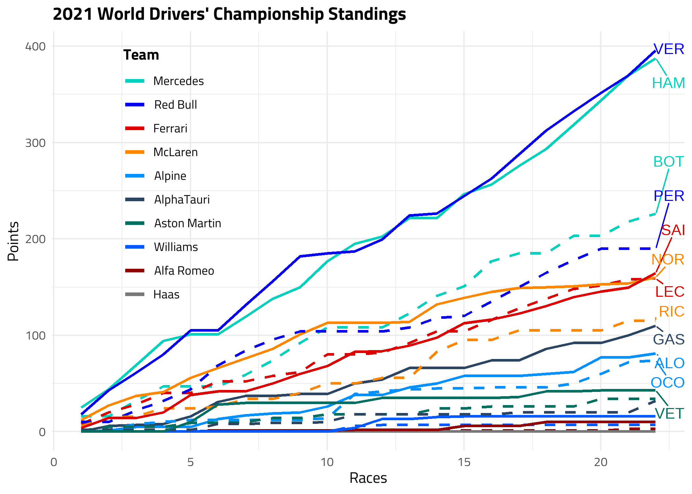

```{r setup, include=FALSE}
knitr::opts_chunk$set(echo = FALSE,
                      fig.align = "center",
                      warning = FALSE,
                      tidy = FALSE,
                      message = FALSE)

library(tidyverse)
```

# Introduction

Formula One (F1) has served as the world’s highest level of open-wheel racing for over 70 years. While its popularity has fluctuated over time, the sport has recently experienced a resurgence thanks to its increased Internet presence after an ownership change in 2017. Given F1’s rich history and nuances, informative data visualizations can help new fans quickly understand the sport’s past and present.

# The Best Drivers and Teams of All Time

Although fans consider many factors when debating the greatest F1 driver of all time, drivers’ total career race wins serve as a simple but informative metric. Since the length of an F1 season and drivers’ careers have varied over time, it is also helpful to examine a driver’s win rate as determined by their total wins divided by total races entered. Figure \@ref(fig:drv-wins) depicts both of these statistics using bar plots.

```{r drv-wins, fig.cap="Bar plots of the top 10 driver win counts and their win rates.", out.width="100%"}
knitr::include_graphics("drv_bars.png")
```

Figure \@ref(fig:drv-wins) highlights Lewis Hamilton and Michael Schumacher as the winningest F1 drivers of all time by a large margin. Along with Hamilton, the plot also features two other current drivers in Sebastian Vettel and Fernando Alonso. While Hamilton remains the top driver in terms of win rate, Alonso and Vettel are ranked lower mainly due to their long careers and lower present-day success. Meanwhile, Jim Clark and Jackie Stewart move up the rankings compared to their win totals. Both drivers raced during the 1960s, which featured significantly shorter seasons than modern F1. As a result, their total wins are relatively low but their win rates are higher than most drivers.

A similar analysis can be done for F1’s many teams to find the longest-running and most successful ones. Figure \@ref(fig:team-wins) displays the top 10 F1 teams by win count and their respective win rates.

```{r team-wins, fig.cap="Bar plots of the top 10 team win counts and their win rates.", out.width="100%"}
knitr::include_graphics("team_bars.png")
```

Figure \@ref(fig:team-wins) indicates that Ferrari is the most successful F1 team of all time. Additionally, it is the only team to have competed in every F1 season since 1950. All of the top 5 winningest teams remain in the sport today, highlighting how success leads to longevity. While Mercedes has competed in fewer seasons than many of the top teams, it has dominated the sport in recent years, winning every Constructors’ Championship since 2014 and taking first place in nearly half of the races it has entered. While this success is partly due to having the fastest car, having one of the greatest drivers of all time in Lewis Hamilton has propelled the team to untouchable status.

# What Makes an Exciting Race?

Many aspects of an F1 race can make it exciting, but a common statistic used to objectively evaluate a race’s quality is the number of overtakes that occur. The FIA, the sport’s governing body, often changes the rules and regulations to promote overtaking while improving safety. While the regulations change every year and have included changes to the tires and aerodynamic components of the cars, fans often group regulations into “eras” based on the type of engine used. Figure \@ref(fig:pos-box) depicts the distribution of race overtakes from 2000 to 2021 based on the type of engine used in the cars.

```{r pos-box, fig.cap="Box plot of overtakes per driver per race from 2000 to 2021.", out.width="100%"}
knitr::include_graphics("pos_box.png")
```

Figure \@ref(fig:pos-box) indicates that overtaking has declined overall since 2000. While the median overtakes are similar across the V8 and V6 eras, the variance of overtaking is lower in the V6 era, suggesting that “boring” races happen more consistently. This trend may be partly due to the different engines used, but increasingly complex car aerodynamics across eras have also been blamed for generating “dirty air” that makes it more difficult to overtake. F1 cars have also become longer and wider over this period, leaving less room for passing to occur. Overall, this plot provides insight into the reasoning behind the new 2022 regulations that aim to simplify cars’ aerodynamics and increase overtaking.

# The 2021 Season: A New Champion

After seven years of F1 domination from Lewis Hamilton and Mercedes, many fans were ready for new title challengers in 2021. While Max Verstappen and team Red Bull had been strong performers in recent years, 2021 marked the first time they could truly contend for the championship in the V6 era. Figure \@ref(fig:standings-line) displays each driver’s cumulative championship points across each round of the 2021 season.

```{r standings-line, fig.cap=" Line plot of WDC standings for each round of the 2021 season.", out.width="100%"}

```

Figure \@ref(fig:standings-line) highlights the close competition between Verstappen and Hamilton for the 2021 World Drivers’ Championship. Ultimately, Verstappen emerged as the winner after a last-lap overtake on Hamilton in the final race of the season. The plot also highlights that both drivers were far ahead of their teammates despite driving the same cars. This stresses the importance of both team and driver performance when competing for a title.

While championship points ultimately matter the most, further analyzing a driver’s performance can provide insights into their strengths, weaknesses, and how they compare to their teammates. Figure \@ref(fig:quali-race-scatter) shows the 2021 drivers’ average race finishing positions plotted against their average qualifying positions.

```{r quali-race-scatter, fig.cap="Scatterplot of average finishing position versus average qualifying position.", out.width="100%"}
knitr::include_graphics("quali_race_scatter.png")
```

Overall, the trend in Figure \@ref(fig:quali-race-scatter) is similar to that of Figure \@ref(fig:standings-line), with the top drivers in the bottom left of the scatterplot. Examining the points’ positions relative to the 45-degree line reveals drivers’ strengths. For instance, Sergio Perez (PER) and Pierre Gasly (GAS) were relatively strong qualifiers but tended to lose positions during races. On the other hand, drivers like Daniel Riccardio (RIC) and Lance Stroll (STR) typically qualified behind their teammates but closed the gap during races.

# Conclusion

F1’s long history and many performance indicators make visualization very useful in introducing new fans to the sport. While recent races have been less exciting and dominated by Lewis Hamilton and Mercedes, but there are signs that these trends began to change in 2021. New drivers, improved teams, and disruptive regulation changes can all contribute to a better viewer experience. Although the 2022 season is less than halfway over, excitement has grown as Charles Leclerc and team Ferrari have begun to challenge for the championship for the first time in several years.

# Data Source

Rao, R. (2022, April 11). Formula 1 World Championship (1950-2022), https://www.kaggle.com/datasets/rohanrao/formula-1-world-championship-1950-2020

